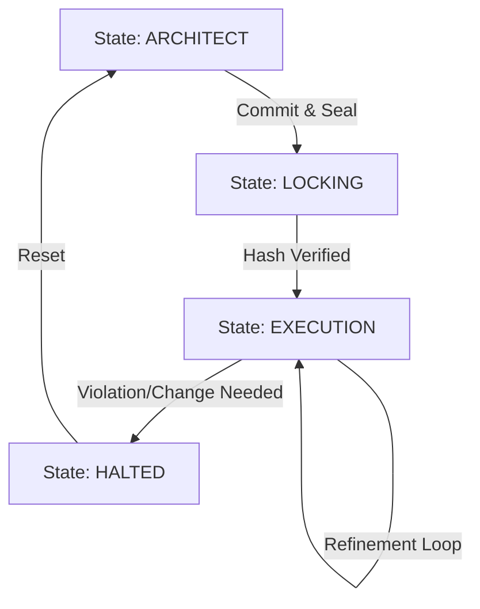

# Logic64 Workflow Protocols & State Machine

> [!IMPORTANT]
> **Protocol**: Phase-Shift State Machine
> **Enforcement**: Cryptographic Lock (SHA-256)

## 1. The Three-State Machine
Logic64 operates as a Finite State Machine (FSM) where strictly defined transitions are allowed.

## 2. Detailed State Protocols

### 🔵 STATE 1: ARCHITECT (The Design Phase)
**Objective**: Produce a valid `blueprint.md` and `constraints.json`.

*   **Allowed Actors**:
    *   Human Architect (via Web/Cursor).
    *   Architect Node (Claude 3.5 Sonnet).
*   **Protocol**:
    1.  **Input**: User Requirement ("I need a JWT Auth service").
    2.  **Reasoning**: Architect Node analyzes patterns, suggests options.
    3.  **Refinement**: Iterative text-based refinement.
    4.  **Artifact Generation**: Writing to `.logic64/`.
*   **Transition Trigger**: User command `CONFIRM_BLUEPRINT` or UI Button "Sync & Lock".

### 🔒 STATE 2: LOCKING (The Transition Phase)
**Objective**: Create the immutable point of reference.

*   **Allowed Actors**:
    *   Gateway (Internal Process ONLY).
*   **Protocol**:
    1.  **Read**: Scan all files in `.logic64/` (excluding lock file).
    2.  **Hash**: Compute SHA-256 of contents.
    3.  **Write**: Generate `.logic64/integrity.lock`.
    4.  **Verify**: Read back and confirm hash match.
*   **Transition Trigger**: Successful Write operations.

### 🟢 STATE 3: EXECUTION (The Build Phase)
**Objective**: Implement code matching the locked artifacts.

*   **Allowed Actors**:
    *   Human Developer.
    *   Cursor/IDE Agent.
    *   Validator Node.
*   **Protocol**:
    1.  **Trigger**: Code Edit Request.
    2.  **Integrity Check**: Gateway validates `integrity.lock` vs Disk.
        *   *If Fail*: **Immediate HALT** -> Transition to HALTED.
    3.  **Constraint Check**: Validator Node scans code against `constraints.json`.
        *   *If Pass*: Write allowed.
        *   *If Fail*: Reject with error.

## 3. The "Halt & Reset" Convention
If a developer realizes the architecture was wrong during Execution:
1.  **They cannot "fix it on the fly".**
2.  They must trigger a **RESET**.
3.  System deletes `integrity.lock`.
4.  State reverts to `ARCHITECT`.
5.  Code execution is suspended until re-locked.
